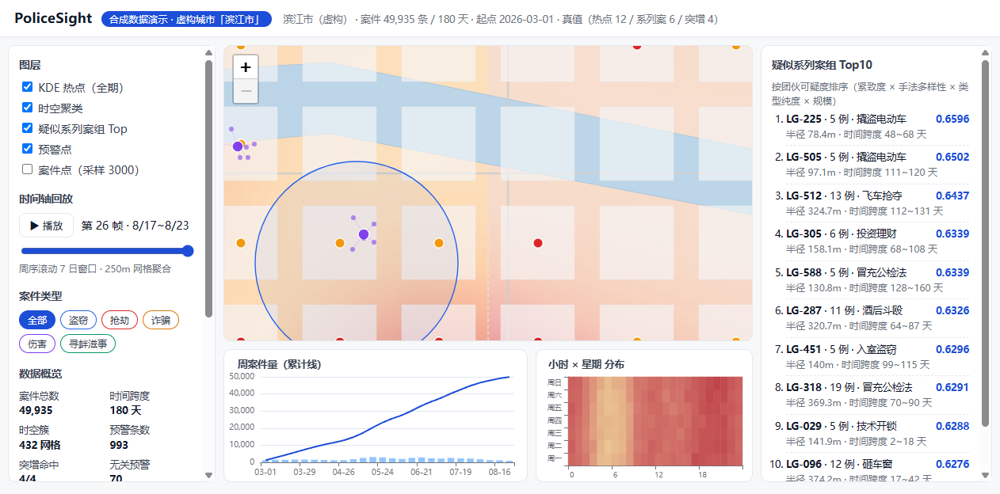
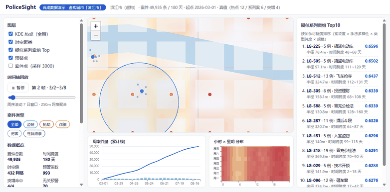
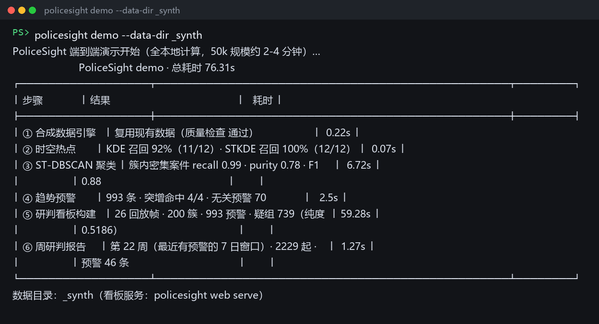
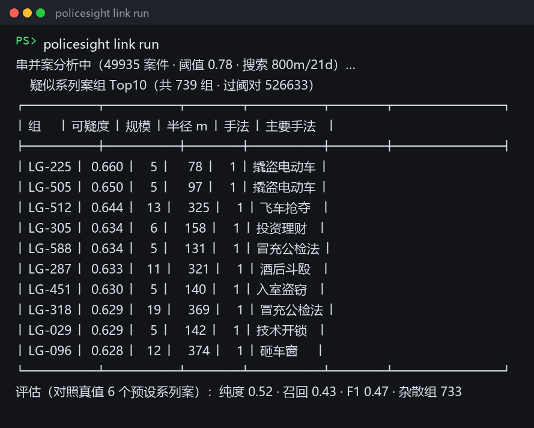

# PoliceSight · 警情时空智能研判平台

> 带真值的合成警情数据引擎 → KDE/STKDE 时空热点 → ST-DBSCAN 聚类 → 串并案图谱 → 突增预警 → 单页研判看板与周研判报告。

[](https://github.com/maoshenghe2-debug/PoliceSight/actions)


**全部数据为合成数据**（虚构城市「滨江市」）· 全本地离线可复现 · 不涉及任何真实警情或个人数据 · 不做个体画像与预测。

## 演示



时间轴回放（26 帧 · 周序滚动 7 日窗口 · 250m 网格）：



端到端一条命令（本机实测 **76s**，含 5 万条数据全链路与看板构建）：

```bash
policesight demo            # 数据 → 热点 → 聚类 → 串并案 → 预警 → 看板 → 周报
policesight web serve       # 打开 http://127.0.0.1:8770
```



## 核心能力

| 模块 | 实现 | 评估（对照真值） |
|---|---|---|
| **合成数据引擎** | 5 万条 / 180 天 / **0.52s**；12 预设热点 + 6 系列案团伙 + 4 突增场景（逐案归属） | 质量检查 0 问题 |
| **热点分析** | KDE 核密度 + STKDE 时空核密度（3D 网格高斯核） | 热点召回 **91.7%**（KDE）/ **100%**（STKDE） |
| **时空聚类** | ST-DBSCAN（cKDTree 缩放度量，O(n log n)）+ 退化参数体检 | 聚类 **F1 0.867**（基线空间-only 0.531） |
| **串并案** | 多特征相似度（时空/手法/文本）+ 团伙可疑度排名 + Louvain 图谱 | 纯度 0.52 @5万（0.835 @2万，规模效应如实披露） |
| **趋势预警** | STL/ETS + YAML 规则（区域×类型 + 网格邻域双粒度） | 注入突增场景 **4/4 命中** · 无关预警 7.0% |
| **研判看板** | 离线矢量底图 + 热力 + 回放 + 图表（Leaflet/ECharts 本地化） | 全离线、仅监听 127.0.0.1 |
| **周研判报告** | HTML（内联 SVG）+ DOCX（python-docx） | 一条命令产出 |

回归对照（`docs/benchmark.md` / `docs/benchmark-link-alert.md`，由 CLI 真实运行产出，可复现）：



## 快速开始

```bash
git clone https://github.com/maoshenghe2-debug/PoliceSight.git && cd PoliceSight
uv venv --python 3.11 && uv pip install -e ".[all]"
policesight doctor                                   # 环境自检（9 项）
policesight data generate --cases 50000 --seed 42    # 合成数据 + 真值
policesight hotspot bench --cases 50000 --seeds 41,42,43,44,45   # 定标测评
policesight link run                                 # 串并案分组 + 评估
policesight alert run                                # 突增预警 + 真值验收
policesight web build && policesight web serve       # 看板
policesight report weekly                            # 周报（HTML + DOCX）
```

## 设计与边界

- **真值同源**：数据生成器同步输出 `ground_truth.json`（预设热点/系列案/突增场景的逐案归属），所有算法评估都对照真值，协议写入报告；
- **离线优先**：底图为仓库自带合成矢量图（CRS.Simple），前端依赖（Leaflet/ECharts）本地化，无任何外部请求；
- **隐私边界**：全合成数据、不做个体画像/个体预测，预警为区域级资源配置辅助提示；
- **可复现**：固定 seed 的确定性生成，`docs/*.md` 测评报告由 CLI/脚本真实运行产出。

## 许可

[Apache-2.0](LICENSE) ｜ 第三方组件：[THIRD_PARTY_NOTICES.md](THIRD_PARTY_NOTICES.md)

---

*作者：何茂生（Maosheng He）· 本项目为技术演示，与任何执法机构无关。*
